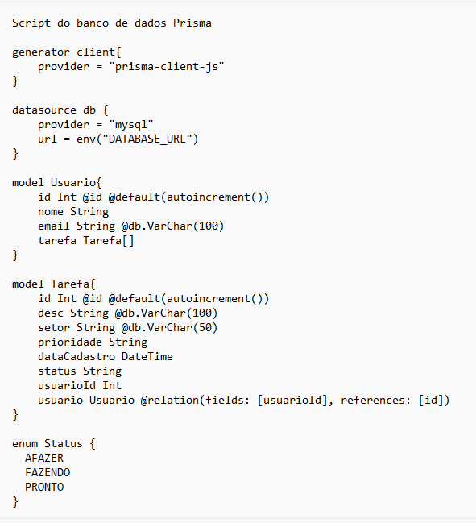

# To do (tarefas)
Sistema simples de gerenciamento de tarefas e status com as funcionalidades CRUD básicas

## Situação de aprendizagem desafiadora

## Contextualização
Uma indústria, do ramo alimentício, gerencia tarefas de seus setores utilizando o kanban. Não foi realizado um mapeamento do fluxo de cada setor, apenas é feito o controle das tarefas em modelo simplificado como o to do list, onde as etapas são divididas em: a fazer, fazendo e pronto. O kanban foi utilizado por compartilhar as informações de forma visual, aumentando a transparência e permitindo que toda equipe do setor fique ciente das tarefas. Porém, a necessidade da empresa é aumentar a visibilidade das tarefas e integrar as informações entre todos os setores.

## Desafio
Fazendo o uso dos seus conhecimentos, utilize as linguagens que aprendeu durante o curso para criar uma aplicação que faça o gerenciamento de tarefas no formato to do list. Os dados do usuário que a empresa deseja armazenar são: id, nome, e-mail. Em relação às tarefas a empresa deseja que sejam armazenados os seguintes dados: id da tarefa, id do usuário, descrição da tarefa, nome do setor, prioridade (baixa, média e alta), data de cadastro e status (a fazer, fazendo e pronto) que por padrão será
inserido como a fazer. 
Um usuário pode cadastrar uma ou mais tarefas, porém uma tarefa é cadastrada por somente um usuário. O gerenciamento da tarefa deve funcionar da seguinte forma: após o usuário cadastrar a tarefa, ele poderá gerenciar a mesma, selecionando-a e alterando seu status, prioridade, ou os dois, atualizando a tarefa. 
A apresentação das tarefas será feita em uma tabela com três colunas representando cada status. Para garantir a integridade das informações todos os campos de cadastro deverão ser de inserção obrigatória. Não é necessário a implementação do controle de acesso do usuário (login, sessão, níveis). Abaixo você verá detalhadamente as entregas que deverão ser efetuadas e quais requisitos elas deverão cumprir.

Imagens 

||
|:-:|
||
|:-:|
||

